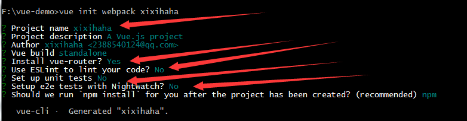

我会用很小的一个项目，来介绍vuex的使用。

什么样的同学适合看这篇文章呢? 

**会使用一点vue，但是不会使用vuex**

话不多说，直接撸代码。

## 安装
安装vue，以及vue-cli,
打开cmd，命令行窗口，输入以下命令
```    
    npm install -g vue && npm install -g vue-cli
```

## 生成项目模板
你在f盘下，新建一个文件夹vue-demo,然后**按住shift,右单击键**,找到'在此处打开命令行窗口'，点进去，在弹出来的窗口输入以下命令
```
    vue init webpack xixihaha
    cd xixihaha
```
一共四步，我来解释下。

一路回车，遇到箭头的那个地方，就按图上的选项进行操作。

进入`xixihaah`文件夹

这个时候，别关闭命令行窗口，我们接着安装模块。在目录`F:\vue-demo\xixihaha>`下，输入
```
    npm install --save vuex
```
这样，就是安装vuex模块了。

-------
这下，我们需要的东西都齐全了。我们输入:
```
    npm run dev
```
然后，浏览器打开；`http://localhost:8080`,就可以看到我们的项目了。

## 目录结构
在src目录下新建一个views和store文件夹。
解释:
> * components文件夹用来放页面级大组件
> * views用来放页面中的小组件
> * store用来放置vuex需要的文件

然后我们把components文件夹里的 `HelloWorld.vue` 删除，新建 `create.vue`和`complete.vue`两个文件。

在store目录下，新建`index.js`文件。

同时，在views文件夹里，又新建三个文件夹: `create`，`complete`，`common`。

在 `create` 目录下又新建两个文件: `create-select.vue`  `create-text.vue`。

在 `common` 目录下新建一个文件`result.vue`。


在 `./xixihaha/static/`目录下新建一个img文件夹，然后，将这四张图片放入img文件夹中。


到此，我们所需要的文件都齐全了。

> `common`用来存放一些可复用的小组件。

修改完后，如图:


## 修改路由
打开 `router/idnex.js` ,修改成下面这样

```
    import Vue from 'vue'
    import Router from 'vue-router'
    import create from '@/components/create'
    import complete from '@/components/complete'

    Vue.use(Router)

    export default new Router({
      routes: [
        {
          path: '/',
          name: 'create',
          component: create
        },
        {
            path: '/complete',
            name: 'complete',
            component: complete
        }
      ]
    })

```

将create.vue修改成:
```
    <template>
        <p>{{msg}}</p>
    </template>
    <script>
        export default {
            data() {
                return {
                    msg: 'wocao'
                }
            }
        }
    </script>
```

这个时候，我们已经可以在浏览器中，看见`wocao`。那就证明，我们没有错。可以继续下一步了。

## 加入vuex

将 `store/index.js`修改为:
```
    import Vue from 'vue'
    import Vuex from 'vuex'

    Vue.use(Vuex);

    const store = {
        state:{
            src: '',
            text: '',
            done: false,
            test: '嘻嘻哈哈'  
        },
        mutations: false,
        getters: false,
        actions: false
    }

    export default new Vuex.Store(store);
```

修改 `src/main.js`
```

    import Vue from 'vue'
    import App from './App'
    import router from './router'
    import store from './store'  // 引入 store
    Vue.config.productionTip = false

    /* eslint-disable no-new */
    new Vue({
      el: '#app',
      router,
      store,  // 在全局对象vue上注册
      components: { App },
      template: '<App/>'
    })

```

然后，我们做个测试:

`create.vue` 内容:
```
    <template>
        <div>       
            <p>{{msg}}</p>
            <create-select></create-select>
        </div>
    </template>
    <script>
        import createSelect from '../views/create/create-select.vue'
        export default {
            data() {
                return {
                    msg: 'wocao'
                }
            },
            components:{
                'create-select': createSelect
            }
        }
    </script>
```

`views/create/create-select.vue`内容:
```
    <template>
        <p>{{msg}}</p>
    </template>
    <script>
        export default {
            data() {
                return {
                    msg: 'wocao'
                }
            },
            created() {
                console.log(this.$store.state.test)
            }
        }
    </script>
```

写好后，我们刷新浏览器，如果，控制台打印出`嘻嘻哈哈`，就证明我们没有问题。继续下一步。

--------------

## 安心撸代码
前面都算是一些事前工作，但是却是最重要的。只有那些不出问题，我们才能安心的写我们的项目。

vuex是全局状态管理工具，那无外乎就是从里面拿数据，以及将数据传给vuex。只要这个清楚了就好办了。

将数据传给vuex的流程是，主要的语法你们自己在vuex官网看就懂了，这里只讲过程: 

1. 组件发出dispatch
2. 经过actions,然后在actions里面commit
3. 经过mutataions,在这里面修改state。

组件从vuex里拿数据有两种，

1. 访问 `$store.state` 就可以拿到state了。
2. 访问 `$store.getters` 就可以拿到getters了。

这两者的区别，在于 `state` 在官网的规范中，建议是常量，他们推荐用 `getters` 来获取vuex的数据。

所以这个小项目都是用 `getters` 来获取数据。


将 `/store/index.js` 修改为:
```
    import Vue from 'vue'
    import Vuex from 'vuex'

    Vue.use(Vuex);

    const initiState = {
        src: '',
        text: '',
        showText: false,
        done: false,
        test: {name: 'Alice'}  
    };

    const store = {
        state: {...initiState},
        getters: {
            showText_getters(state) {
                return state.showText;
            },
            getText_getters(state) {
                return state.text;
            },
            getImgSrc_getters(state) {
                return state.src;
            },
            done_getters(state) {
                return state.done;
            }
        },
        mutations: {
            imgSelected_mutations(state, payload) {         
                state.src = payload;
                state.showText = true;
            },
            textInput_mutations(state, payload) {
                if (payload.length) { 
                    state.done = true;
                } else {
                    state.done = false;
                } 
                state.text = payload;
            },
            reset_mutations(state) {
                // 重置state
                this.replaceState({...initiState});
            }
        },
        actions: {
            imgSelected_actions(store,payload) {
                store.commit('imgSelected_mutations', payload);
            },
            textInput_actions(store, payload) {
                store.commit('textInput_mutations', payload);
            },
            reset_actions(store) {
                store.commit('reset_mutations');
            }
        }
    }

    export default new Vuex.Store(store);
```


`create.vue` 修改:
```
    <template>
        <div>       
            <p>{{msg}}</p>
            <create-select></create-select>
        </div>
    </template>
    <script>
        import createSelect from '../views/create/create-select'
        export default {
            data() {
                return {
                    msg: 'wocao',
                }
            },
            components:{
                'create-select': createSelect
            }
        }
    </script>
```

`create-select.vue` 文件修改为:
```
    <template>
        <div class="create-select">
            <template v-for='(item, index) in src'>
                <label  :for=" 'doge' + index"  @click='handleClickSrcToStore(index)'>
                    
                    <p>doge{{index+1}}</p>
                    <input type="radio" name="doge" :id="'doge'+index">
                </label>
            </template>
        </div>
    </template>
    <style scoped>
        .create-select  {
            width: 800px;
            height: 300px;
            margin: auto;
        }
        .create-select label {
            float: left;
            width: 200px;
            height: 300px;
        }
        .create-select label img {
            display: block;
            height:180px;
            width: 180px;
            margin: auto;

        }
        
    </style>
    <script>
        export default {
            data() {
                return {
                    src: [
                        './static/img/doge_1.png',
                        './static/img/doge_2.png',
                        './static/img/doge_3.png',
                        './static/img/doge_4.png'
                    ]
                }
            },
            methods: {
                handleClickSrcToStore($id) {
                    console.log($id);
                    // 在这里，把我们dispatch发出action
                    this.$store.dispatch('imgSelected_actions', this.src[$id])
                }
            },
            created() {
                // 测试数据是否能打印出来
                console.log(this.$store.state.test)
            }
        }
    </script>
```
不出意外，浏览器应该会渲染出:
,

我们继续。

修改 `create.vue` 为:
```
    <template>
        <div>       
            <p>{{msg}}</p>
            <create-select></create-select>
            <template v-if='showText_com'>          
                <create-text></create-text>
                <result></result>
            </template>
            <template v-if='done_com'>
                <router-link to="/complete" tag="button" >跳转哦</router-link>
            </template>
        </div>
    </template>
    <script>
        import createSelect from '../views/create/create-select'
        import createText from '../views/create/create-text'
        import result from '../views/common/result'
        export default {
            data() {
                return {
                    msg: 'wocao',
                }
            },
            computed: {
                showText_com() {
                    return this.$store.getters.showText_getters;
                },
                done_com() {
                    return this.$store.getters.done_getters;
                }
            },
            components:{
                'create-select': createSelect,
                'create-text': createText,
                'result': result,
            }
        }
    </script>
```

修改 `create-text.vue` 为:
```
    <template>
        <div class="create-text">
            <label for="txt">请输入文本:<input type="text" @input='handleInput($event)' id="txt" name="txt"></label>
        </div>
    </template>
    <style></style>
    <script>
        export default {
            data() {
                return {
                    msg: 'wocao'
                }
            },
            methods: {
                handleInput($event) {
                    // 这个是当我们输入时，会通过dispatch，actions,mutations一路来修改state
                    // 第一个参数对应着actions内的key值，也就是函数名。
                    this.$store.dispatch('textInput_actions', $event.target.value)
                }
            }
        }
    </script>
```

> * result.vue里面是从vuex里拿数据。

修改 `result.vue` 为:
```
    <template>
        <div class="result">
            <p>{{text}}</p>
            
        </div>
    </template>
    <style>
        .result {
            height: 250px;
            width: 200px;
            margin: auto;
            margin-top: 60px;
            position: relative;
            top: 0;
            left: 0;
        }
        .result p {
            position: absolute;
            bottom: 0;
            left: 0;
            right: 0;
            margin: 0 auto;
        }
        .result img {
            display:block;
            width: 200px;
            height: 200px;
        }
    </style>
    <script>
        export default {
            data() {
                return {
                    msg: 'wocao'
                }
            },
            computed: {
                src() {
                    return this.$store.getters.getImgSrc_getters;
                },
                text() {
                    return this.$store.getters.getText_getters;
                }
            }
        }
    </script>
```

这样的话，这个项目已经完成了80%了。


修改 `complete.vue` 为:
```
    <template>
        <div class="complete">
            <result></result>
            <button @click='handleClick'>重置</button>
        </div>
    </template>
    <script>
        import result from '../views/common/result'
        export default {
            data() {
                return {
                    msg: 'wocao'
                }
            },
            methods: {
                handleClick() {
                    // 函数式跳转，重置store，并且返回到首页
                    this.$store.dispatch('reset_actions');
                    this.$router.push('./');
                }
            },
            components: {
                'result': result
            }
        }
    </script>
```

至此，，我们整个项目就已经完成了。。。可能细节没有讲清楚，有不懂的地方可以直接联系我。