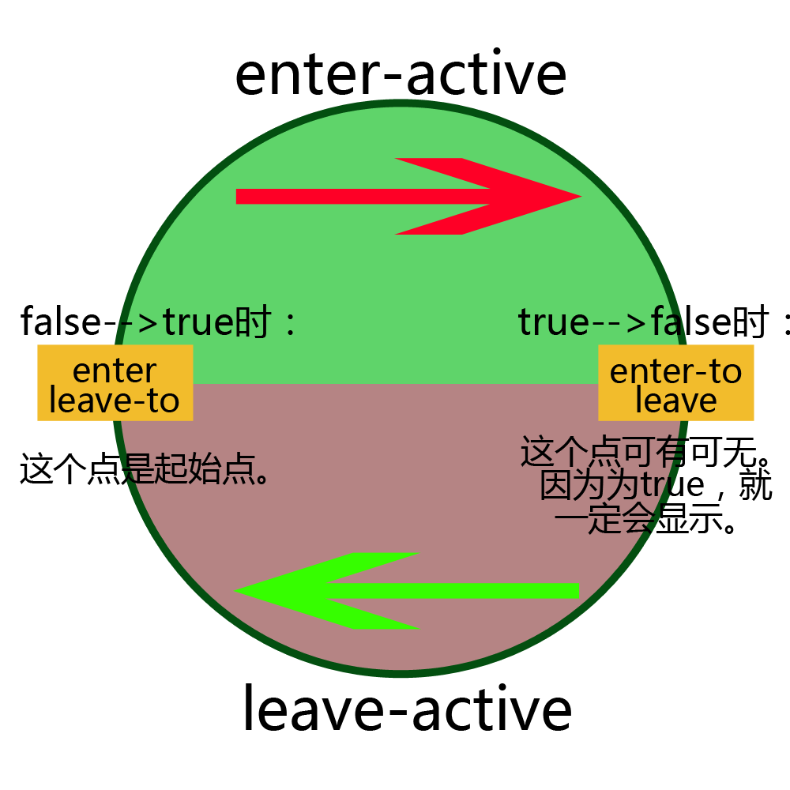

### 单元素/组件的过渡

Vue 提供了 transition 的封装组件，在下列情形中，可以给任何元素和组件添加 entering/leaving 过渡
* 条件渲染 (使用 v-if)
* 条件展示 (使用 v-show)
* 动态组件
* 组件根节点

代码示例：

 
过渡顺序：
 * 当v-if,v-show的值为从false变成true,也就是官网里称之为'进入过渡':
		类名的触发顺序是：enter--->enter-active--->enter-to
 * 当v-if,v-show的值为从true变成false,也就是官网里称之为'离开过渡':
		类名的触发顺序是: leave--->leave-active--->leave-to

其实可以把他们想成一个环形:


过渡类名的含义:

1. `v-enter`：定义进入过渡的开始状态。在元素被插入时生效，在下一个帧移除。

2. `v-enter-active`：定义过渡的状态。在元素整个过渡过程中作用，在元素被插入时生效，在 `transition/animation` 完成之后移除。这个类可以被用来定义过渡的过程时间，延迟和曲线函数。

3. `v-enter-to`: 2.1.8版及以上 定义进入过渡的结束状态。在元素被插入一帧后生效 (于此同时 v-enter 被删除)，在 transition/animation 完成之后移除。

4. `v-leave`: 定义离开过渡的开始状态。在离开过渡被触发时生效，在下一个帧移除。

5. `v-leave-active`：定义过渡的状态。在元素整个过渡过程中作用，在离开过渡被触发后立即生效，在 `transition/animation` 完成之后移除。这个类可以被用来定义过渡的过程时间，延迟和曲线函数。

6. `v-leave-to`: 2.1.8版及以上 定义离开过渡的结束状态。在离开过渡被触发一帧后生效 (于此同时 `v-leave` 被删除)，在 `transition/animation` 完成之后移除

概括上面来讲：
  就是当你点击按钮，isShow从false变为true，然后v-if控制的元素是不是得显示出来？？？是吧。也就是说enter,enter-active,enter-to这三个类控制着元素从消失到插入再到完全显示出来的过程中css的变化。

  enter类，就是当false变为true，enter类会和enter-active类**同时**(注意：是同时！！！)给v-if元素添加这个类，然后，然后，重点来了，
  添加完后，这个元素会被按照enter类的规则强制位移，然后下一帧(也就是一刹那之后),enter类被移除，被移除的同时enter-to被添加进这个元素。但是！！！但是！！！enter-active并没有被移除，还是绑定在v-if元素上，接着元素就会按照enter-active的transition设置的过渡规则，从enter过渡到enter-to。

  而当isShow从true变为false时，元素也会按照这个上面的顺序来执行。但是！！！注意了！！！因为isShow变成了false，导致了v-if控制的元素最后是会消失的！！！也就是说就算你在leave-to里设置成了`opacity:1`，元素在最后还是会消失或者被移除。

  同样的就算你在设置成这样

```
	.xixi-enter{
		opacity:1;
	}
	.xixi-enter-to{
		opacity:0;
	}
 ```
 结果会是，当isShow从false-->true,元素的opacity会从1慢慢降到0，最后完全变为0后下一帧又立马变成1。

 这是由于v-if,v-show自身决定的。

**那么这又引申出另外一个结论**
 1. enter-to设置的属性应当是与我们给元素自定义的类的属性一样，也就是说：
`enter-to的属性值 == leave的属性值 == 我们初始设置的class属性值`我们不要用id给元素设置属性，id的优先级太高了。会覆盖所有的class类。

 2. 基于1结论，我们得到：
`enter的属性值 == leave-to的属性值`

 3. 由于1,2结论，再加上v-if,v-show的机制，可以得到，

  * `enter-to`,`leave`:这两个属性应当设置opacity为1

  * `enter`,`leave-to`:这两个属性应当设置opacity为0


**最重要的一点：上面的六个类在过渡完成后，全都会被移除！！！元素最终的式样仍会是我们的自定义类的设置！！！**
这就是为什么我们要把enter-to,leave类设置成我们自定义类的属性。


代码示例:
```
	

	<!DOCTYPE html>
	<html lang="en">
	<head>
		<meta charset="UTF-8">
		<title>Document</title>
	</head>
	<style>
		*{margin:0;padding: 0;}
		.child{
			height:100px;width:100px;background: red;position: absolute;top:100px;
		}

		.xixi-enter-to,.xixi-leave{
			left:0;
		}
		.xixi-enter,.xixi-leave-to{
			left:-100px;
		}
		.xixi-enter-active,.xixi-leave-active{
			transition:all 0.3s;
		}


	</style>
	<script src="../lib/vue.js"></script>
	<body>
		<div id="box">
			<button @click='isShow = !isShow'>我要变化</button>
			<transition name="xixi">
				<div v-if='isShow' class='child'>aaaaaaaaaa</div>
			</transition>
		</div>
	</body>
	<script>
		var vm = new Vue({
			el:'#box',
			data:{
				isShow:false
			}
		})
	</script>
	</html>
```